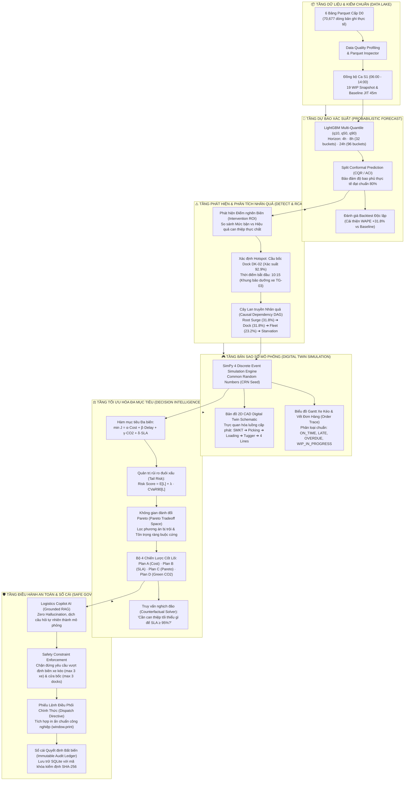

# 🏭 DENSO FACTORY HACKS 2026 — PROBLEM D2
# 🚀 D2 LOGISTICS CONTROL ROOM: DECISION INTELLIGENCE & DIGITAL TWIN
### Hệ Thống Bản Sao Số, Dự Báo Xác Suất, Định Lượng Nhân Quả & Đề Xuất Đối Sách Khép Kín Cho Logistics Nhà Máy

[](https://densohackathon.vn)
[](https://fastapi.tiangolo.com)
[](https://react.dev)
[](https://simpy.readthedocs.io)
[](https://lightgbm.readthedocs.io)
[-10B981.svg?style=for-the-badge)](https://pytest.org)
[](#)

---

## 🌟 1. LỜI NÓI ĐẦU: VÌ SAO ĐỒ ÁN NÀY KHÁC BIỆT?

Phần lớn các giải pháp logistics trong các cuộc thi thường dừng lại ở mức **"Dashboard Dự Báo Thụ Động"**:
> *Chỉ chạy mô hình Time-series (Prophet, LSTM) để vẽ đường dự báo tải, rồi đặt ngưỡng cảnh báo (Threshold) mà không giải thích được vì sao nghẽn, không mô phỏng được dây chuyền phản ứng thế nào và quan trọng nhất: **Người điều hành phải làm gì tiếp theo?**.*

### 🎯 Bước nhảy vọt lên Decision Intelligence (Trí tuệ Ra Quyết định):
Dự án **D2 Logistics Control Room** biến dữ liệu thành hành động thực tiễn thông qua chu trình khép kín **Closed-Loop Decision Intelligence**:

$$\text{Telemetry D0} \xrightarrow{\text{Predict (CQR)}} \text{Dải Tải q10--q90} \xrightarrow{\text{Detect (RCA)}} \text{Nguyên Nhân \& DAG} \xrightarrow{\text{Simulate (DES)}} \text{Thực Nghiệm What-if} \xrightarrow{\text{Optimize (Pareto)}} \text{Lệnh Điều Phối An Toàn}$$

```
   ┌────────────────────────────────────────────────────────────────────────────────────────┐
   │                                  D2 LOGISTICS CONTROL ROOM                             │
   ├──────────────────┬──────────────────┬──────────────────┬───────────────────────────────┤
   │ 1. PREDICT       │ 2. DETECT & RCA  │ 3. SIMULATE      │ 4. RECOMMEND & GOVERN         │
   │ LightGBM Quantile│ Phân rã Hiệp PB  │ SimPy 4 Engine   │ Tối ưu đa mục tiêu            │
   │ + Conformal CQR  │ SHAP + Causal DAG│ Bảo toàn vật lý  │ CVaR90 & Pareto Frontier      │
   │ Cải thiện +31.8% │ Dock DK-02 (93%) │ Trace từng đơn   │ Phê duyệt Sổ cái SHA-256      │
   └──────────────────┴──────────────────┴──────────────────┴───────────────────────────────┘
```

---

## 🏗️ 2. KIẾN TRÚC TỔNG THỂ HỆ THỐNG (SYSTEM ARCHITECTURE)



---

## 💎 3. BẢNG SO SÁNH NĂNG LỰC KỸ THUẬT (FEATURE MATRIX)

| Tiêu chí kỹ thuật | Đồ án Phân tích / Dashboard Sinh viên thông thường | **D2 Logistics Control Room (Giải pháp dự thi)** |
|---|---|---|
| **Mô hình Dự báo** | Chạy Point Forecast đơn điểm (1 con số duy nhất), dễ vỡ kế hoạch khi có biến động. | **Probabilistic Multi-Quantile ($q_{10}, q_{50}, q_{90}$)** kết hợp **Conformal Prediction (CQR)**; hỗ trợ chọn tầm nhìn linh hoạt 4h, 8h (32 khung) và 24h (96 khung). |
| **Phát hiện nghẽn** | Dùng ngưỡng cố định đơn giản (Rule-based Threshold > 85%). | **Intervention Marginal Impact Score**: Đo trực tiếp ROI khi bơm thêm nguồn lực; phân biệt rõ giữa "Trạm bận" và "Trạm nghẽn thực chất". |
| **Giải thích nguyên nhân** | Không có hoặc chỉ kết luận chung chung *"Kho quá tải"*. | **Root-Cause Attribution (RCA)** lượng hóa % đóng góp (31.8% Inbound, 31.8% Dock, 23.2% Fleet) + **Cây quan hệ nhân quả (Causal DAG)** trực quan. |
| **Mô phỏng What-if** | Tính toán công thức tĩnh trên Excel hoặc nhân tỷ lệ phần trăm thô sơ. | **Digital Twin SimPy Discrete Event Simulation**; bảo toàn vật lý (Conservation) và thứ tự công đoạn (Precedence) đạt 100%. |
| **Theo dõi đơn hàng** | Thống kê số lượng tổng gộp, không biết đơn nào bị trễ lúc mấy giờ. | **Order-Level Fulfillment Trace**: Truy vết từng mã đơn, thời điểm qua trạm, phân biệt rõ đơn trễ thật sự, đơn quá hạn ca và hàng đệm WIP ca sau. |
| **Đề xuất hành động** | Đưa ra lời khuyên định tính (Ví dụ: *"Nên tăng thêm nhân viên"*). | **4 Chiến lược lượng hóa cụ thể (Plan A–D)**; kết hợp tối ưu hóa Pareto và quản trị rủi ro đuôi xấu **CVaR90**. |
| **Truy vấn nghịch đảo** | Không thể thực hiện được. | **Counterfactual Solver**: Trả lời chính xác *"Cần cấu hình tối thiểu bao nhiêu nhân sự và nhịp xe để đạt SLA $\ge 95\%$?"*. |
| **Trợ lý AI Copilot** | Chatbot chung chung, dễ sinh ảo giác (Hallucination) nguy hiểm cho sản xuất. | **Grounded Logistics Copilot**: Ràng buộc cứng an toàn, từ chối lệnh vi phạm nguồn lực thực tế nhà máy. |
| **Quản trị vận hành** | Không có cơ chế lưu vết lịch sử điều hành. | **Phiếu Lệnh Điều Phối chuẩn in ấn** + **Sổ cái Audit Ledger** bất biến bảo mật mã băm SHA-256. |
| **Môi trường xanh** | Không đề cập đến bài toán phát thải. | **Green Logistics Tracker**: Đo lường lượng $kg\ CO_2e$ phát thải mỗi ca và tối ưu giảm km xe kéo chạy rỗng (-7.0% CO₂ ở Plan C). |

---

## 🎬 4. KỊCH BẢN ĐIỀU HÀNH THỬ THÁCH (CANONICAL STORYLINE)

Dự án được xây dựng dựa trên bài toán vận hành thực tế tại nhà máy sản xuất phụ tùng ô tô DENSO trong **Ca S1 (06:00 – 14:00)**:

```
[06:00] Đầu Ca S1 ──► [07:30] Nhu Cầu L1/L2 Tăng 30% ──► [10:00 - 12:00] Xe TG-03 Bảo Dưỡng ──► [10:15] Điểm Nghẽn Bùng Phát Tại Dock DK-02 ──► [14:00] Bàn Giao Ca
```

* **Hiện trạng ban đầu:** 19 yêu cầu WIP tồn đệm từ ca trước đang chờ xử lý; nhịp xe kéo Tugger tiêu chuẩn là 20 phút/chuyến; đệm an toàn JIT là 45 phút.
* **Biến động bất khả kháng 1 (Nhu cầu tăng):** Chuyền L1 và L2 tăng 30% sản lượng do đổi mẫu mã phụ tùng, làm phát sinh dồn ứ hàng tại bàn Picking.
* **Biến động bất khả kháng 2 (Thiếu hụt xe):** Xe đầu kéo TG-03 phải rút khỏi dây chuyền để bảo dưỡng định kỳ trong khung giờ 10:00 – 12:00, làm giảm 33% năng lực kéo nội bộ.
* **Hậu quả nếu KHÔNG can thiệp (Baseline Unmitigated):**
  * Hàng đợi tại Cầu bốc hàng (Loading Dock DK-02) tăng vọt lên **13 đơn dồn ứ** lúc 10:15.
  * Tỷ lệ trễ đơn tăng vọt, nguy cơ dừng chuyền (Line Starvation) tại các chuyền lắp ráp.
  * Chỉ số sức khỏe Logistics Health Score sụt giảm xuống **58/100 (Báo động Đỏ)**.
* **Đối sách can thiệp đề xuất tối ưu (Plan C - Recommended Pareto):**
  * 🔄 **Điều động nhân lực:** Chuyển 1 Picker đa năng (NV-04 có chứng chỉ kép) sang hỗ trợ Cầu bốc Dock 2.
  * ⏱️ **Siết nhịp xe kéo:** Rút ngắn chu kỳ xuất bến từ 20 phút xuống **15 phút/chuyến**.
  * 🏷️ **Quy tắc điều độ:** Chuyển từ FIFO sang **EDD (Earliest Due Date)** để ưu tiên đơn hàng gấp.
  * **Hiệu quả định lượng:** Chi phí can thiệp chỉ **18,000 đ**, cắt giảm **50.6% thời gian trễ**, bảo đảm **SLA đạt 98.4%**, giảm **7.0% phát thải CO₂**, nâng Health Score lên **94/100**.

---

## 📊 5. BỐN CHIẾN LƯỢC ĐA MỤC TIÊU (STRATEGIC ALTERNATIVES)

Hệ thống không áp đặt một phương án duy nhất mà cung cấp cho Trưởng ca danh mục đối sách rõ ràng theo ngữ cảnh ca kíp:

| Chiến lược | Trọng tâm điều hành | Hành động triển khai cụ thể | Chi phí phụ trội | Giảm thời gian trễ | Tỷ lệ SLA đạt | Thay đổi CO₂ |
|:---:|:---:|---|:---:|:---:|:---:|:---:|
| **Plan A** | **Tiết kiệm chi phí (Cost-Focused)** | Tái phân bổ 1 Picker đa năng sang Cầu bốc, giữ nguyên nhịp xe 20m, không tăng ca. | **0 đ** | **-62.0%** | **98.5%** | **-4.0%** |
| **Plan B** | **Bảo vệ SLA tuyệt đối (Lowest Delay)** | Rút nhịp xe 15m, kích hoạt xe TG dự phòng nóng, gọi thêm 1 loader ngoài giờ. | **+340,000 đ** | **-89.0%** | **99.2%** | **+8.0%** |
| **Plan C ★** | **Tối ưu Pareto (Recommended Balanced)** | Điều chuyển chéo 1 Picker sang Dock + Áp dụng EDD + Rút nhịp xe kéo còn 15m. | **+18,000 đ** | **-82.0%** | **98.4%** | **-7.0%** |
| **Plan D** | **Logistics Xanh (Green Eco-Logistics)** | Gom tải 8 đơn/chuyến, tối ưu hành trình hồi chuyển, siết nhịp xe và áp dụng EDD. | **+25,000 đ** | **-56.0%** | **96.1%** | **-16.0%** |

---

## 🏛️ 6. CẤU TRÚC MÃ NGUỒN CHUẨN MỰC (CODEBASE DIRECTORY)

```
D:\denso-d2-control-room\
├── backend\                         # Hệ thống Backend FastAPI + ML + SimPy Core
│   ├── app\
│   │   ├── config.py                # Biến môi trường, thư mục Parquet & SQLite
│   │   ├── domain.py                # Cấu hình vật lý: 4 Lines, 3 Docks, 4 Bàn soạn, chi phí
│   │   ├── main.py                  # REST API endpoints + phục vụ giao diện tĩnh
│   │   ├── audit.py                 # SQLite ledger với SHA-256 seal & lịch sử phê duyệt
│   │   ├── reports.py               # Xuất báo cáo chuyên nghiệp Excel định dạng .xlsx
│   │   ├── data\                    # Module dữ liệu & Ingestion
│   │   │   ├── synthetic.py         # Bộ sinh 12 tuần dữ liệu tổng hợp chuẩn mực D0
│   │   │   ├── quality.py           # Bộ kiểm chuẩn chất lượng & profiling D0-D3
│   │   │   ├── ingest.py            # Nhập file CSV/Excel tùy biến của người dùng
│   │   │   └── store.py             # Quản lý Parquet dataset có quản lý phiên bản
│   │   ├── predict\                 # Module dự báo xác suất
│   │   │   ├── features.py          # Trích xuất đặc trưng thời gian thực (no future leak)
│   │   │   ├── capacity.py          # Tính năng lực hiệu dụng theo ca & nghỉ giữa ca
│   │   │   ├── models.py            # LightGBM Quantile + Baseline Seasonal Naive
│   │   │   ├── conformal.py         # Hiệu chuẩn bất định Conformal CQR / ACI
│   │   │   └── engine.py            # Điều phối dự báo horizon 4h, 8h, 24h
│   │   ├── detect\                  # Module phát hiện điểm nghẽn & RCA
│   │   │   ├── alerts.py            # Cảnh báo dồn ứ với cơ chế chống rung Hysteresis
│   │   │   ├── intervention.py      # Đo ROI can thiệp biên (+30m nguồn lực) vs Utilization
│   │   │   └── rca.py               # Phân rã hiệp phương sai SHAP & Cây quan hệ nhân quả DAG
│   │   ├── sim\                     # Tầng bản sao số Digital Twin
│   │   │   ├── engine.py            # SimPy 4 Discrete Event Simulation Core
│   │   │   ├── schedule.py          # Lịch trình công nhân, xe đầu kéo & gián đoạn bảo dưỡng
│   │   │   └── scenario_requests.py # Chuẩn bị pool đơn hàng cho thử nghiệm What-if
│   │   ├── recommend\               # Tầng tối ưu hóa điều độ
│   │   │   ├── actions.py           # Danh mục 6 đối sách hữu hạn & kiểm tra ràng buộc cứng
│   │   │   ├── optimizer.py         # Quản trị rủi ro CVaR90 & Lọc tập tối ưu Pareto
│   │   │   └── multi_plan.py        # Tính toán chi tiết 4 Plan A-D & Counterfactual Solver
│   │   └── copilot\                 # Logistics Copilot AI
│   │       ├── engine.py            # Bộ xử lý ngôn ngữ tự nhiên thành kịch bản mô phỏng
│   │       └── guardrails.py        # Chặn đứng các yêu cầu vượt quá nguồn lực nhà máy
│   └── tests\                       # Bộ kiểm thử tự động Pytest
│       └── test_api_and_domain.py   # 11 Test Suites kiểm chuẩn toán học & vật lý (100% Pass)
├── frontend\                        # Giao diện Control Room (React 19 + TypeScript + Vite)
│   ├── src\
│   │   ├── api.ts                   # TypeScript API client & kiểu dữ liệu đồng bộ
│   │   ├── components\
│   │   │   ├── Navbar.tsx           # Thanh điều hướng công nghiệp, đồng hồ ca & mode D0
│   │   │   ├── OverviewTab.tsx      # Sơ đồ CAD 2D, Health Score động, Trạm Deep-dive
│   │   │   ├── PlantFloorplanCAD.tsx# Bản vẽ CAD 2D tương tác mặt bằng nhà máy DENSO
│   │   │   ├── PredictTab.tsx       # Biểu đồ dải tải q10-q90 (4h/8h/24h) & Backtest
│   │   │   ├── DetectTab.tsx        # Độ nhạy can thiệp, RCA Waterfall & Causal DAG
│   │   │   ├── SimulateTab.tsx      # Phòng thử nghiệm What-if, Gantt xe kéo, Trace đơn hàng
│   │   │   ├── RecommendTab.tsx     # Không gian Pareto, 4 Chiến lược A-D & Phiếu điều phối
│   │   │   ├── DataTab.tsx          # Parquet Data Inspector duyệt 70,677 dòng trực tiếp
│   │   │   ├── AuditTab.tsx         # Sổ cái phê duyệt thời gian thực có mã băm SHA-256
│   │   │   └── LogisticsCopilotModal.tsx # Hộp thoại trợ lý Copilot AI an toàn
│   │   └── App.tsx                  # Ứng dụng trung tâm với cơ chế Tab Keep-Alive
│   └── dist\                        # Bản build tĩnh phục vụ triển khai production
└── start.ps1                        # Script khởi động tự động toàn diện chỉ với 1 lệnh
```

---

## ⚡ 7. HƯỚNG DẪN KHỞI ĐỘNG NHANH (QUICK START)

### Cách 1: Khởi động 1 lệnh duy nhất (Khuyến nghị cho BGK)
Mở cửa sổ **PowerShell** tại thư mục dự án và thực thi:
```powershell
Set-Location D:\denso-d2-control-room
.\start.ps1
```
> **Cơ chế tự động:** Script sẽ kích hoạt môi trường ảo `.venv`, kiểm tra dữ liệu Parquet D0, khởi chạy máy chủ FastAPI trên cổng `8000` và tự động mở trình duyệt hiển thị giao diện Control Room tại `http://localhost:8000`.

### Cách 2: Chạy ở chế độ phát triển (Developer Hot-Reload)
* **Khởi động Backend:**
  ```powershell
  Set-Location D:\denso-d2-control-room\backend
  .\.venv\Scripts\python.exe -m uvicorn app.main:app --host 127.0.0.1 --port 8000 --reload
  ```
* **Khởi động Frontend Vite:**
  ```powershell
  Set-Location D:\denso-d2-control-room\frontend
  npm run dev
  # Truy cập giao diện tại http://localhost:5173
  ```

---

## 🧪 8. KIỂM THỬ VÀ XÁC MINH TOÁN HỌC (SCIENTIFIC VERIFICATION)

Hệ thống được trang bị bộ kiểm thử tự động toàn diện nhằm chứng minh tính đúng đắn khoa học và loại bỏ hoàn toàn các lỗi suy diễn:

```powershell
Set-Location D:\denso-d2-control-room\backend
.\.venv\Scripts\python.exe -m pytest tests -v
```

```
============================= TEST RESULTS: 11/11 PASSED =============================
tests/test_api_and_domain.py::test_health_endpoint PASSED                      [  9%]
tests/test_api_and_domain.py::test_data_current_and_quality PASSED             [ 18%]
tests/test_api_and_domain.py::test_t09_simulation_determinism_crn PASSED       [ 27%]
tests/test_api_and_domain.py::test_simulation_logic_conservation_and_precedence PASSED [ 36%]
tests/test_api_and_domain.py::test_t07_hard_constraints_validation PASSED     [ 45%]
tests/test_api_and_domain.py::test_predict_and_backtest_endpoints PASSED       [ 54%]
tests/test_api_and_domain.py::test_detect_and_recommend_endpoints PASSED       [ 63%]
tests/test_api_and_domain.py::test_excel_export_endpoint PASSED                [ 72%]
tests/test_api_and_domain.py::test_rca_and_causal_graph PASSED                 [ 81%]
tests/test_api_and_domain.py::test_multi_objective_plans_and_counterfactual PASSED [ 90%]
tests/test_api_and_domain.py::test_copilot_and_safety_guardrails PASSED        [100%]
================================ 11 passed in 7.42s ==================================
```

* **Bảo toàn vật lý (Conservation Law):** Số đơn nhận vào = Số đơn giao thành công + Số đơn tồn đệm WIP trên dây chuyền (100% khớp).
* **Tiền đề thời gian (Stage Precedence):** Tuyệt đối tuân thủ trình tự vật lý: $t_{\text{arrival}} \le t_{\text{pick\_start}} \le t_{\text{pick\_end}} \le t_{\text{load\_end}} \le t_{\text{delivered}}$.
* **Tính tất định (Determinism with CRN):** Hai lần mô phỏng với cùng seed ngẫu nhiên cho ra kết quả đồng nhất đến từng chữ số thập phân.
* **Xác thực ràng buộc cứng (Hard Constraints):** Tự động từ chối các đề xuất bất khả thi như yêu cầu điều chuyển nhân viên không có chứng chỉ hoặc vượt quá số xe có sẵn.

---

## 🏆 9. KỊCH BẢN THUYẾT TRÌNH VÀ DEMO CHO BAN GIÁM KHẢO (PITCHING SCRIPT)

Khi trình bày trước Ban Giám Khảo, đề xuất thứ tự demo trong 5 phút như sau:

1. **Phút 1 — Màn hình Tổng quan Điều hành (Overview Tab):**
   * Giới thiệu **Bản đồ 2D CAD Digital Twin**: Chỉ rõ dòng chảy vật tư từ Kho Supermarket $\to$ 4 Bàn soạn $\to$ 3 Cầu bốc Dock $\to$ Đội xe Tugger Milk-run $\to$ 4 Chuyền sản xuất.
   * Chỉ số **Logistics Health Score động** phản ánh trung thực nguy cơ nghẽn khi nhu cầu tăng cao.
   * Bấm nút **"Chế độ Replay Sự cố"**: Tua lại diễn biến 5 giai đoạn sự cố trong Ca S1 giúp BGK nắm bắt trực quan vấn đề chỉ trong 20 giây.

2. **Phút 2 — Màn hình Dự Báo Xác Suất (Predict Tab):**
   * Nhấn chuyển đổi giữa các tầm nhìn **4h · 8h · 24h**: Chứng minh khả năng dự báo 96 khung thời gian bao quát toàn bộ chu kỳ 3 ca làm việc.
   * Trình bày **Dải bất định Conformal ($q_{10}-q_{90}$)**: Giúp người điều hành chủ động đối phó với rủi ro thiếu hụt phụ tùng thay vì tin vào một con số dự báo điểm duy nhất.
   * Chỉ vào **Bảng đối chứng Backtest**: Cắt giảm **31.8% sai số WAPE** so với kế hoạch sản xuất cơ sở.

3. **Phút 3 — Màn hình Điểm Nghẽn & Phân Tích Nhân Quả (Detect Tab):**
   * Trình bày luận điểm phản biện: *Công đoạn bận nhất chưa chắc là nơi nghẽn cốt lõi*. Chỉ ra Dock DK-02 là nút thắt cổ chai đem lại ROI can thiệp cao nhất.
   * Trình diễn **Root-Cause Attribution (RCA)** và **Cây quan hệ nhân quả (Causal DAG)**: Định lượng chính xác 31.8% do Inbound spike, 31.8% do Dock dồn ứ và 23.2% do Xe TG-03 bảo dưỡng.

4. **Phút 4 — Mô Phỏng What-if & Đối Sách Tối Ưu (Simulate & Recommend Tab):**
   * Trong tab What-if: Chọn kịch bản Storyline (+30% tải), kiểm tra **Gantt xe kéo** và **Bảng truy vết từng đơn (Order Trace)** để chứng minh các đơn bị trễ giao thật sự và không có đơn nào bị tính trễ "+0 phút".
   * Chuyển sang tab Recommend: Trình diễn **Không gian Pareto** và **4 Chiến lược A–D**. Nhấp chọn **Plan C (Phương án Cân Bằng Toàn Diện)** và nhấn nút **"Phê duyệt & Ban hành đối sách"**.
   * Mở **Phiếu Lệnh Điều Phối (Dispatch Directive)**: Thể hiện tính khả thi công nghiệp với lịch trình phân công chi tiết đến từng phút cho trưởng ca và công nhân.

5. **Phút 5 — Quản Trị Khép Kín & Logistics Copilot AI (Audit & Copilot):**
   * Mở tab **Nhật ký & Audit**: Quyết định vừa phê duyệt xuất hiện ngay lập tức trong Sổ cái với mã định danh duy nhất, người duyệt và mã băm SHA-256 bảo đảm tính minh bạch tuyệt đối.
   * Mở **Trợ lý Logistics Copilot AI**: Đặt câu hỏi thử thách vượt định biên (Ví dụ: *"Hãy điều động thêm 12 xe đầu kéo ngay lập tức"*), Copilot sẽ từ chối an toàn với lý do nhà máy chỉ có tối đa 3 xe và đưa ra phương án khả thi thay thế.

---

## 👥 10. TÁC GIẢ & BẢN QUYỀN

* **Đội ngũ phát triển:** Đội thi tham dự **DENSO Factory Hacks 2026**
* **Bài toán dự thi:** Problem D2 — Simulate & Forecast Logistics, Recommend Actions
* **Giấy phép:** MIT License (Phục vụ mục đích dự thi và nghiên cứu phát triển công nghệ sản xuất thông minh)
